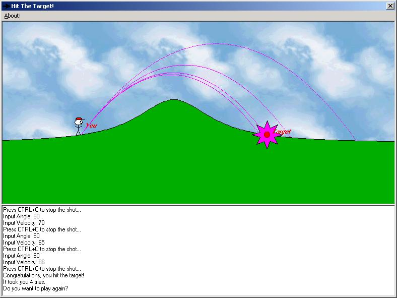



## Arrow Game

### Description

To play a great, simple game. Keeps kids busy for hours and teaches them some laws of physics.
 
### More Info
 
If you want to use a version of VB before 6, you'll have to use a converter.

Slow on a 486, which is what I originally built it on :-)

             |
---                |---
**Submitted On**   |2000-07-01 15:55:54
**By**             |[Craig Andrews](https://github.com/Planet-Source-Code/PSCIndex/blob/master/ByAuthor/craig-andrews.md)
**Level**          |Intermediate
**User Rating**    |4.8 (24 globes from 5 users)
**Compatibility**  |VB 4\.0 \(16\-bit\), VB 4\.0 \(32\-bit\), VB 5\.0, VB 6\.0
**Category**       |[Games](https://github.com/Planet-Source-Code/PSCIndex/blob/master/ByCategory/games__1-38.md)
**World**          |[Visual Basic](https://github.com/Planet-Source-Code/PSCIndex/blob/master/ByWorld/visual-basic.md)
**Archive File**   |[CODE\_UPLOAD7345712000\.zip](https://github.com/Planet-Source-Code/craig-andrews-arrow-game__1-9436/archive/master.zip)

### API Declarations

Sleep

